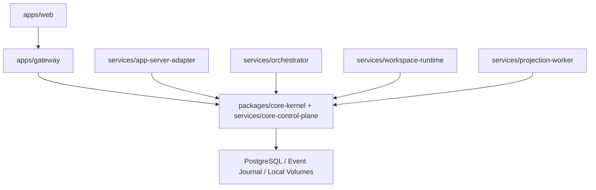

# NadoVibe Architecture

NadoVibe is a greenfield browser-first multi-agent IDE platform. The Core Control Plane Kernel owns product authority; every server is a port adapter around Core.

Rules:

- Gateway mutations call Core command APIs.
- App-Server Adapter uses the generated schema registry and method policy matrix before app-server traffic is accepted.
- Workspace Runtime enforces WorkScope, FileLease, and CapacityReservation before execution.
- Orchestrator validates AgentTaskContract before agent work.
- Projection Worker rebuilds read models from durable Core events.
- Browser clients never receive app-server credentials, raw container URLs, or `code-server` passwords.

The initial implementation includes service health/readiness endpoints and executable policy endpoints so the service shell is not a mock-only path.
