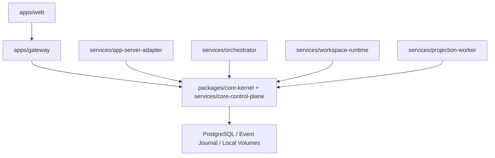

# NadoVibe Architecture

NadoVibe is a greenfield browser-first multi-agent IDE platform. The Core Control Plane owns product authority; every server is a port adapter around Core.

The current implementation keeps the original intent explicit:

- Core is the only authority for run state, policy, capacity admission, lease validation, supervisor decisions, event append, replay, and idempotency.
- Gateway is the only browser-facing API boundary. It does not own Core state and does not access workspace files directly.
- App-Server Adapter is a typed Codex app-server integration boundary, not the product core.
- Workspace Runtime owns workspace side effects: file tree/read/search/write, WorkScope/FileLease enforcement, command planning, editor session metadata, and Docker sandbox lifecycle endpoints.
- Orchestrator and agents must operate through Core contracts and runtime gateways.
- Projection Worker rebuilds read models from durable Core events.
- Per-user/per-workspace sandbox containers are execution surfaces. They do not contain a copy of Gateway, Core, Event Store, Projection Worker, Orchestrator, or App-Server Adapter.
- Deployment Agent owns service sandbox release activation, Docker service restart, health verification, and mounted release version consistency checks.

## Service Rules

- Gateway mutations call Core command APIs.
- Gateway file operations call Workspace Runtime APIs.
- App-Server Adapter uses the generated schema registry and method policy matrix before Codex app-server traffic is accepted.
- Workspace Runtime enforces WorkScope, FileLease, and CapacityReservation before execution.
- Orchestrator validates AgentTaskContract before agent work.
- Projection Worker rebuilds read models from durable Core events.
- Browser clients never receive app-server credentials, raw container URLs, or `code-server` passwords.

## Core Package Boundaries

- `packages/core-events`: append-only event journal contract, optimistic concurrency, idempotency, and secret payload rejection.
- `packages/core-protocol`: app-server JSON-RPC validation, initialize gate, method policy matrix, capability module registry, transport guard, and overload classification.
- `packages/core-security`: tenant isolation, destructive action approval gate, and secret redaction.
- `packages/core-resource`: capacity reservation, fair scheduling, quota profiles, heavy command guard, and overload/drain behavior.
- `packages/core-agent`: AgentTaskContract, AgentLease, AgentBudget, heartbeat, and SupervisorDecision validation.
- `packages/core-workspace`: WorkScope, FileLease, workspace command guard, sandbox/code-server metadata, and editor session policy.
- `packages/core-kernel`: CoreControlPlane command admission, state machines, durable event append, replay, and completion guard.
- `packages/core-operations`: environment profile, stack order, preflight, version metadata, migration, backup/restore, rollout, canary, and rollback policy.
- `packages/core-durability`: deterministic long-run simulation, replay validation, reconnect validation, and durability report generation.
- `packages/api-contract`: public parser/client/projection contracts that hide internal capacity and runtime details from users.
- `packages/ui`: browser shell renderers for web Control Room, tablet Workbench, and mobile Command Review.

## Runtime Data Model

PostgreSQL is the primary source of truth when `DATABASE_URL` is configured. Core writes command idempotency records and events to durable storage. Local append-only journal storage exists for development runs without a database URL.

NATS remains optional fanout infrastructure. It is not the source of truth for product state.

Local volumes are explicit for event journal, PostgreSQL data, object/artifact storage, repositories, workspaces, app-server state, audit logs, backups, and service logs.

Platform services are deployed as service sandboxes. The container image supplies the Node runtime, while the NadoVibe code is mounted from `/data/docker_data/nadovibe/runtime/current` and pinned by `nadovibe.release.json`. See `docs/service-sandbox-deployment.md`.

## UX Intent

The user experience must feel like a multi-agent chat IDE, not an infrastructure control panel. Users issue work at workspace level and receive agent responses, decisions, review requests, and progress through web/tablet/mobile surfaces. Internal terms such as quota, CapacityReservation, waiting_for_capacity, backpressure, overload, queue position, raw container id, token, password, and filesystem path are operator-only details and must not appear in public responses.

The implementation includes service health/readiness endpoints and executable policy endpoints so the service shell is not a mock-only path.
