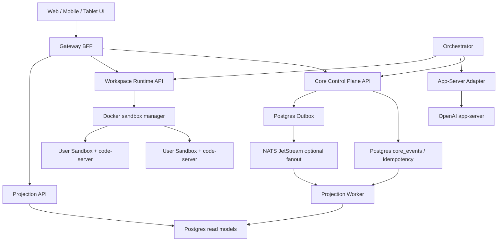

# Current Source Architecture Review

작성일: 2026-04-24

## 결론

현재 소스는 UI와 코어 정책 단위 테스트는 통과하지만, 문서가 목표로 하는 "Core Control Plane 단일 권한 + 장시간 멀티에이전트 작업 내구성" 구조로는 아직 일부 미완성 영역이 남아 있습니다. 이번 변경으로 Gateway가 별도 인메모리 Core를 갖던 가장 큰 문제는 제거했고, Core Control Plane 서비스가 command/query/event/idempotency API와 durable store를 소유하도록 전환했습니다.

이번 점검에서 즉시 반영 가능한 안정성 보강으로 다음을 수정했습니다.

- Tablet Workbench가 `lease_tablet_*` 값을 브라우저에서 직접 만들어 파일 저장 권한처럼 쓰던 구조를 제거했습니다.
- Workspace Runtime이 파일 read 시 서버 발급 FileLease를 만들고, write 시 `assertWriteFileAllowed()`로 WorkScope/FileLease를 검증하게 했습니다.
- Gateway의 workspace file tree/read/search/write 직접 파일시스템 접근을 제거하고 `WORKSPACE_RUNTIME_URL`을 통한 Runtime API 호출로 전환했습니다.
- Gateway `/readyz`가 자체 인메모리 상태만 보지 않고 `CORE_CONTROL_PLANE_URL`의 `/readyz`를 확인하게 했습니다.
- local/Portainer/dev compose에 `CORE_CONTROL_PLANE_URL`을 명시했습니다.
- boundary lint가 client-forged lease 재도입을 차단하게 했습니다.
- Core Control Plane 서비스에 HTTP command/query/event/idempotency API를 추가했습니다.
- Core Control Plane이 `DATABASE_URL`이 있으면 Postgres `core_events`, `core_command_idempotency`를 사용하고, 개발 환경에서는 로컬 append-only journal을 사용할 수 있게 했습니다.
- Gateway의 `new CoreControlPlane()`를 제거하고 `CoreControlPlaneClient`를 통해 Core API만 호출하게 했습니다.
- Projection Worker가 Core API에서 event를 읽어 read model을 재생성할 수 있게 했습니다.
- Workspace Runtime에 Docker Engine socket 기반 sandbox provision/stop API와 workspace file tree/read/search/write API를 추가했습니다.

## 확인한 구조 문제

### 1. Core 권한이 실제로 단일화되어 있지 않음

- `services/core-control-plane/src/server.ts`는 단일 authoritative Core runtime을 생성합니다.
- `apps/gateway/src/server.ts`는 더 이상 `new CoreControlPlane()`를 생성하지 않고 Core HTTP API를 호출합니다.
- `services/projection-worker/src/server.ts`는 더 이상 replay용 `new CoreControlPlane()`를 생성하지 않고 Core events를 읽어 projection을 재생성합니다.

이 문제는 이번 변경으로 1차 해결했습니다. 이제 Gateway에서 생성한 run/event는 Core Control Plane 서비스의 event journal을 통해 기록됩니다.

### 2. Postgres는 compose에 있지만 Core event store로 연결되지 않음

`packages/core-events/src/index.ts`에는 `PostgresEventJournalRepository`와 DDL이 있고, 이번 변경으로 `services/core-control-plane/src/server.ts`의 `PostgresCoreStore`가 동일 테이블에 event/idempotency를 기록합니다.

`DATABASE_URL`이 설정된 Portainer/local compose에서는 Postgres가 Core 명령/event/idempotency의 durable source of truth입니다. `DATABASE_URL`이 없는 개발 실행에서는 로컬 append-only journal을 명시적인 개발용 저장소로 사용합니다.

### 3. Gateway가 BFF를 넘어 workspace side effect를 직접 수행함

Gateway는 더 이상 파일 tree/read/search/write를 직접 파일시스템에서 처리하지 않습니다. 이번 변경으로 동일 공개 API는 유지하면서 실제 파일 접근, FileLease 발급, write 검증, 검색은 Workspace Runtime이 소유합니다.

Gateway의 목표 역할은 다음으로 제한되어야 합니다.

- 사용자 인증/세션 확인
- UX용 projection 조합
- Core command API 호출
- realtime stream relay
- Workspace Runtime/App-Server Adapter로의 명시적 proxy

### 4. Workspace Runtime은 실제 sandbox runtime이 아니라 policy planner에 가까움

`services/workspace-runtime/src/server.ts`는 기존에는 WorkScope/FileLease, provision plan, command plan, editor session metadata를 검증하거나 생성하는 수준이었습니다. 이번 변경으로 `/v1/workspace/provision`, `/v1/workspace/stop`가 Docker Engine API를 호출해 sandbox container lifecycle을 직접 제어할 수 있고, `/v1/workspace/files/*`, `/v1/workspace/search`가 Runtime 경계 안에서 파일 접근을 처리합니다.

목표 구조에서는 Workspace Runtime이 다음을 직접 소유해야 합니다.

- user/workspace별 sandbox container 생성/재시작/삭제
- code-server process/session/reverse proxy route 관리
- workspace file read/write/search 완료
- runtime command dispatch/cancel/output/artifact capture
- Core lease/capacity reservation과 실제 Docker resource limit 일치 검증

### 5. Projection Worker가 durable journal을 tailing하지 않음

현재 projection-worker는 POST로 받은 event 배열을 replay합니다. 운영 구조에서는 `core_events` 또는 NATS JetStream을 tailing하고 read model을 재생성해야 합니다.

### 6. durability suite는 중요한 정책을 확인하지만 실제 장시간 운영 검증은 아님

`packages/core-durability`의 phase 10 suite는 deterministic simulation입니다. 설계 검증에는 유효하지만, 실제 3시간 wall-clock run, Docker restart, DB interruption, gateway/core restart 후 상태 보존을 검증하지 않습니다.

## 더 좋은 목표 구조

## 구현 전환 순서

1. Core HTTP command/query API를 먼저 완성합니다. 완료
   - `seedIdentity`, `createRun`, `transitionRun`, `recordSupervisorDecision`, `startAgentWork`, `appendDomainEvent`, `readEvents`, `readRun`을 core-control-plane 서비스 API로 노출했습니다.
   - Postgres event journal/idempotency를 실제 런타임 저장소로 연결했습니다.

2. Gateway에서 `new CoreControlPlane()`를 제거합니다. 완료
   - Gateway는 `CoreControlPlaneClient`만 사용합니다.
   - projection은 Core event API에서 읽습니다.

3. Workspace file API를 Gateway에서 Workspace Runtime으로 이동합니다. 완료
   - Gateway는 `WorkspaceRuntimeClient`를 통해 file tree/read/search/write를 호출합니다.
   - FileLease 발급/검증/만료/저장 후 폐기는 Runtime 내부 상태와 WorkScope 정책으로 처리합니다.
   - 저장 완료 후 Gateway는 Core에 `WorkspaceFileWritten`, `DiffUpdated` event를 기록합니다.

4. Orchestrator를 실제 장시간 작업 제어기로 승격합니다.
   - AgentTaskContract queue, heartbeat, retry budget, cancellation token, handoff를 durable하게 저장합니다.
   - SupervisorAgent는 모든 하위 Agent 제어를 Core command로만 수행합니다.

5. Sandbox manager를 구현합니다. 부분 완료
   - user/workspace별 code-server container를 실제 Docker API로 생성/시작/정지하는 API를 추가했습니다.
   - container label, named volume, CPU/memory/pids/disk/log limit를 Core reservation과 맞춥니다.
   - production에서는 raw code-server port, 인증 정보, container id를 브라우저에 노출하지 않고 Gateway reverse proxy session만 사용해야 합니다.

6. Projection Worker를 durable stream 기반으로 바꿉니다. 부분 완료
   - Projection Worker가 Core event API에서 event를 읽어 read model을 생성합니다.
   - 다음 단계에서는 NATS JetStream durable consumer 또는 Postgres offset checkpoint를 추가해야 합니다.

7. 실제 통합 검증을 추가합니다.
   - `docker compose up`
   - run 생성 후 Gateway restart
   - Core restart
   - Postgres connection interruption
   - Workspace Runtime restart
   - sandbox kill/recreate
   - 최소 30분 smoke, 이후 3시간 soak

## SupervisorAgent 관점 재설계

SupervisorAgent가 안정성을 보장하려면 app-server나 filesystem을 직접 제어하면 안 됩니다. SupervisorAgent는 다음 Core command만 발행해야 합니다.

- `CreateAgentTaskContract`
- `AssignRoleAgent`
- `RecordHeartbeat`
- `RequestCapacityReservation`
- `RequestWorkspaceLease`
- `DispatchRuntimeCommand`
- `PauseRun`
- `ResumeRun`
- `CancelRun`
- `RecordSupervisorDecision`
- `RequestFinalReview`
- `CompleteRun`

RoleAgent/TaskSupervisorAgent도 동일하게 계약, lease, budget, cancellation token 안에서만 움직여야 합니다. 이렇게 해야 사용자는 자원 통제 개념을 몰라도 시스템이 알아서 자원을 분배하고 작업을 끝까지 완수할 수 있습니다.

## 데이터베이스 판단

현재 구조에서는 Postgres를 source of truth로 두는 것이 맞습니다.

- event sourcing, idempotency, outbox, read model, migration, backup/restore에 적합합니다.
- Portainer/Docker 운영에서 백업과 복구 절차가 단순합니다.
- NATS JetStream은 fanout/queue에는 좋지만 source of truth로 두지 않는 편이 안전합니다.
- RethinkDB는 changefeed UX는 좋지만, 장기 운영/마이그레이션/백업/채용 가능성/생태계 기준에서 이 플랫폼의 primary DB로는 Postgres보다 불리합니다.

## 이번 변경의 남은 한계

이번 변경으로 client-forged FileLease, 잘못된 Gateway readiness, Gateway 인프로세스 Core authority, Gateway 직접 파일시스템 접근 문제는 막았습니다. Workspace Runtime은 Docker sandbox lifecycle과 workspace file API를 직접 제어할 수 있게 되었습니다.

아직 완전한 운영 제품으로 남은 큰 작업은 Orchestrator를 장시간 작업 제어기로 승격하고, Projection Worker에 durable checkpoint/read model 저장을 추가하고, 실제 Postgres/Docker/NATS stack에서 30분 smoke와 3시간 soak를 수행하는 것입니다.
